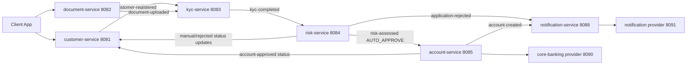

# Customer Onboarding KYC

## Overview

This repository contains six Spring Boot microservices that implement an event-driven customer onboarding and KYC journey.
The flow covers customer registration, document upload, KYC validation, risk decisioning, account provisioning, and customer notification.

Services:

- `customer-service` (8081)
- `document-service` (8082)
- `kyc-service` (8083)
- `risk-service` (8084)
- `account-service` (8085)
- `notification-service` (8086)

## Architecture

The platform combines public synchronous APIs with internal asynchronous event ingestion APIs.



Public APIs:

- Customer Service: `POST /api/v1/customers`, `GET /api/v1/customers/{customerId}`, `PATCH /api/v1/customers/{customerId}/status`
- Document Service: `POST /api/documents`, `GET /api/documents/{id}`
- Account Service: `GET /api/v1/accounts/customer/{customerId}`

Core internal event ingress APIs:

- KYC Service: `/api/internal/events/customer-registered`, `/api/internal/events/document-uploaded`
- Risk Service: `/api/internal/events/kyc-completed`
- Account Service: `/api/internal/events/risk-assessed`
- Notification Service: `/api/internal/events/account-created`, `/api/internal/events/application-rejected`
- Customer Service: `/api/internal/events/manual-approval-required`, `/api/internal/events/application-rejected`, `/api/internal/events/account-approved`

## Setup

Prerequisites:

- Java 17+
- Maven 3.9+

Start services in this order:

1. `customer-service`
2. `document-service`
3. `kyc-service`
4. `risk-service`
5. `notification-service`
6. `account-service`

Run command pattern for each service:

```powershell
cd "<service-directory>"
mvn spring-boot:run
```

Local dependency behavior:

- Account Service uses `core-banking.mock-enabled=true` by default.
- Notification Service uses `notification-provider.mock-enabled=true` by default.
- This allows full local flow execution without external providers.

## Usage

Happy path flow:

1. Register customer in Customer Service.
2. Upload document in Document Service.
3. KYC Service receives both events and performs async validation.
4. On pass, KYC Service sends `kyc-completed` to Risk Service.
5. Risk Service computes decision and score.
6. On `AUTO_APPROVE`, Risk Service calls Account Service.
7. Account Service creates account, notifies Notification Service, and marks customer APPROVED.
8. Notification Service dispatches account-created email.

Reject path flow:

1. KYC and/or Risk decision results in reject.
2. Risk Service updates customer status to REJECTED.
3. Risk Service forwards application-rejected event to Notification Service.
4. Notification Service dispatches rejection email.

Example event payload for account-created notification:

```json
{
  "customerId": "9f0a75ab-f7c6-48d4-a0ac-2c1d8b1df3dd",
  "customerEmail": "alice.walker@example.com",
  "accountNumber": "12345678",
  "sortCode": "10-20-30"
}
```

## Limitations

- All services default to in-memory H2 databases.
- Event propagation uses HTTP callbacks rather than a dedicated message broker.
- No gateway-level authentication/authorization is enforced by default for local flows.

## Troubleshooting

- If flow stops after registration or upload, verify both events reached KYC Service.
- If account is not created, confirm risk disposition is `AUTO_APPROVE`.
- If notifications are missing, verify Notification Service receives payloads with `customerEmail`.
- If provider integrations fail locally, keep mock flags enabled in Account and Notification services.

Service-specific setup and API examples are documented in each service README under the `Java` directory.
