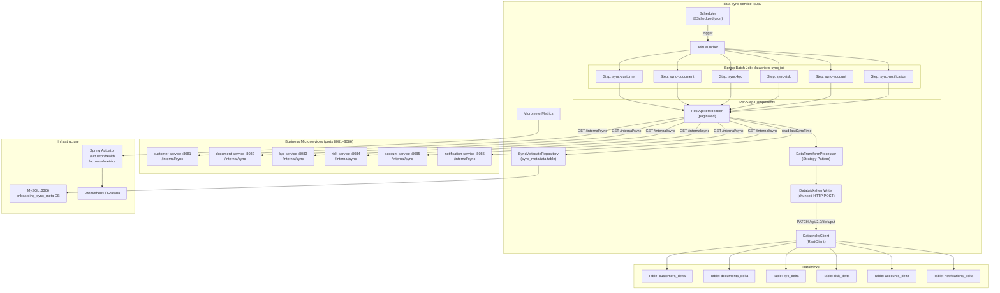
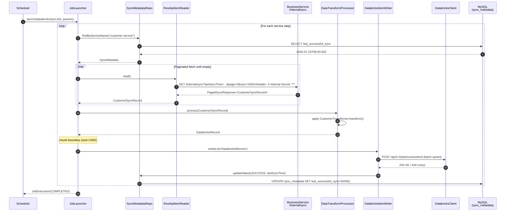
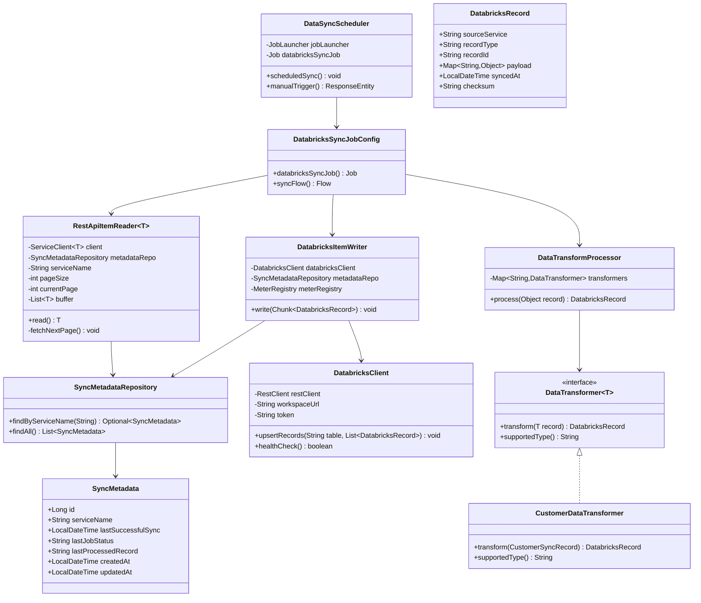
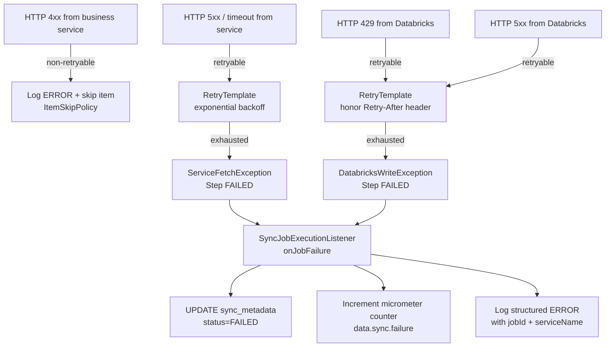
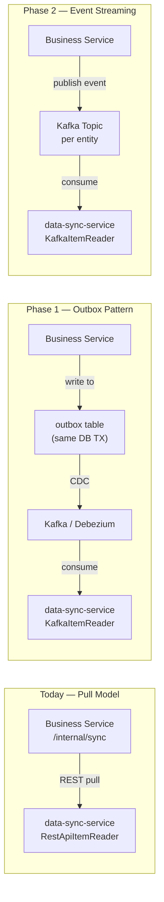

# Data Sync Service — Complete Architecture & Implementation Guide

> **Stack**: Java 21 · Spring Boot 3.3.x · Spring Batch 5.x · MySQL 8 · Databricks REST API  
> **Pattern**: Incremental pull-based sync with idempotent chunk processing

---

## 1. Overall Architecture Diagram



---

## 2. Sequence Diagram



---

## 3. Complete Project Structure

```
data-sync-service/
├── pom.xml
├── Dockerfile
├── src/
│   └── main/
│       ├── java/com/example/datasyncservice/
│       │   ├── DataSyncServiceApplication.java
│       │   │
│       │   ├── batch/
│       │   │   ├── job/
│       │   │   │   └── DatabricksSyncJobConfig.java          ← Job + Flow definition
│       │   │   ├── step/
│       │   │   │   ├── CustomerSyncStepConfig.java
│       │   │   │   ├── DocumentSyncStepConfig.java
│       │   │   │   ├── KycSyncStepConfig.java
│       │   │   │   ├── RiskSyncStepConfig.java
│       │   │   │   ├── AccountSyncStepConfig.java
│       │   │   │   └── NotificationSyncStepConfig.java
│       │   │   ├── listener/
│       │   │   │   ├── SyncJobExecutionListener.java
│       │   │   │   └── SyncStepExecutionListener.java
│       │   │   └── reader/
│       │   │       └── RestApiItemReader.java               ← Generic paginated reader
│       │   │
│       │   ├── client/
│       │   │   ├── CustomerServiceClient.java
│       │   │   ├── DocumentServiceClient.java
│       │   │   ├── KycServiceClient.java
│       │   │   ├── RiskServiceClient.java
│       │   │   ├── AccountServiceClient.java
│       │   │   └── NotificationServiceClient.java
│       │   │
│       │   ├── config/
│       │   │   ├── BatchConfig.java                         ← JobRepository, DataSource
│       │   │   ├── DatabricksConfig.java
│       │   │   ├── RestClientConfig.java
│       │   │   └── MetricsConfig.java
│       │   │
│       │   ├── dto/
│       │   │   ├── sync/                                    ← Inbound from services
│       │   │   │   ├── PagedSyncResponse.java
│       │   │   │   ├── CustomerSyncRecord.java
│       │   │   │   ├── DocumentSyncRecord.java
│       │   │   │   ├── KycSyncRecord.java
│       │   │   │   ├── RiskSyncRecord.java
│       │   │   │   ├── AccountSyncRecord.java
│       │   │   │   └── NotificationSyncRecord.java
│       │   │   └── databricks/                              ← Outbound to Databricks
│       │   │       └── DatabricksRecord.java
│       │   │
│       │   ├── entity/
│       │   │   └── SyncMetadata.java
│       │   │
│       │   ├── exception/
│       │   │   ├── DatabricksWriteException.java
│       │   │   ├── ServiceFetchException.java
│       │   │   └── SyncJobException.java
│       │   │
│       │   ├── processor/
│       │   │   └── DataTransformProcessor.java              ← Routes to strategy
│       │   │
│       │   ├── repository/
│       │   │   └── SyncMetadataRepository.java
│       │   │
│       │   ├── scheduler/
│       │   │   └── DataSyncScheduler.java
│       │   │
│       │   ├── transformer/
│       │   │   ├── DataTransformer.java                     ← Strategy interface
│       │   │   ├── CustomerDataTransformer.java
│       │   │   ├── DocumentDataTransformer.java
│       │   │   ├── KycDataTransformer.java
│       │   │   ├── RiskDataTransformer.java
│       │   │   ├── AccountDataTransformer.java
│       │   │   └── NotificationDataTransformer.java
│       │   │
│       │   ├── util/
│       │   │   ├── SyncTimeUtil.java
│       │   │   └── InternalAuthHeaderUtil.java
│       │   │
│       │   └── writer/
│       │       └── DatabricksItemWriter.java
│       │
│       └── resources/
│           ├── application.yml
│           └── db/changelog/
│               ├── db.changelog-master.xml
│               └── 001-create-sync-metadata.xml
│
└── src/test/java/com/example/datasyncservice/
    ├── batch/
    │   └── reader/RestApiItemReaderTest.java
    ├── processor/
    │   └── DataTransformProcessorTest.java
    ├── transformer/
    │   └── CustomerDataTransformerTest.java
    └── writer/
        └── DatabricksItemWriterTest.java
```

---

## 4. Spring Batch Flow

```mermaid
flowchart TD
    A([Job Start\ndatabricks-sync-job]) --> B{Job already running?}
    B -->|Yes| C([Skip / Abort])
    B -->|No| D[Step 1: sync-customer]
    D -->|SUCCESS| E[Step 2: sync-document]
    D -->|FAILED| F[Mark FAILED\nUpdate sync_metadata]
    E -->|SUCCESS| G[Step 3: sync-kyc]
    E -->|FAILED| F
    G -->|SUCCESS| H[Step 4: sync-risk]
    H -->|SUCCESS| I[Step 5: sync-account]
    I -->|SUCCESS| J[Step 6: sync-notification]
    J -->|SUCCESS| K([Job COMPLETED\nUpdate all timestamps])
    J -->|FAILED| F

    subgraph "Per Step Chunk Processing"
        R1[RestApiItemReader.read()\npage=0, size=1000] --> P1[DataTransformProcessor\nStrategy.transform()]
        P1 --> W1[DatabricksItemWriter\nPOST batch to Databricks]
        W1 -->|next page| R1
        W1 -->|empty page| DONE([Step DONE])
    end
```

---

## 5. Class Diagram



---

## 6. REST API Contracts (Internal Sync Endpoints)

Each business service exposes:

```
GET /internal/sync
```

### Request Parameters

| Parameter     | Type     | Required | Description                              |
|---------------|----------|----------|------------------------------------------|
| `lastSyncTime`| ISO 8601 | Yes      | `2026-07-23T08:00:00Z`                   |
| `page`        | int      | Yes      | 0-based page index                       |
| `size`        | int      | Yes      | Page size (max 1000)                     |

### Request Headers

| Header               | Value                        | Description               |
|----------------------|------------------------------|---------------------------|
| `X-Internal-Secret`  | `${INTERNAL_SERVICE_SECRET}` | Shared secret for internal trust |
| `X-Correlation-Id`   | UUID                         | Propagated for tracing    |

### Response (200 OK)

```json
{
  "content": [
    {
      "customerId": "uuid",
      "firstName": "John",
      "lastName": "Doe",
      "email": "john@example.com",
      "status": "APPROVED",
      "nationality": "GB",
      "city": "London",
      "postcode": "EC1A 1BB",
      "createdAt": "2026-07-23T08:01:00Z",
      "updatedAt": "2026-07-23T09:15:00Z"
    }
  ],
  "page": 0,
  "size": 1000,
  "totalElements": 3240,
  "totalPages": 4,
  "last": false
}
```

### Error Responses

| Status | Scenario                         |
|--------|----------------------------------|
| `400`  | Invalid lastSyncTime format      |
| `401`  | Missing/invalid X-Internal-Secret|
| `429`  | Rate limit exceeded              |
| `500`  | Internal server error            |

---

## 7. DTO Design

### Inbound DTOs (from each microservice)

```java
// Generic paginated wrapper
record PagedSyncResponse<T>(
    List<T> content, int page, int size,
    long totalElements, int totalPages, boolean last
) {}

// Per-service sync records (minimal, analytics-focused)
record CustomerSyncRecord(String customerId, String firstName, String lastName,
    String email, String status, String nationality, String city,
    String postcode, LocalDateTime createdAt, LocalDateTime updatedAt) {}

record AccountSyncRecord(String accountId, String customerId,
    String accountNumber, String sortCode, String accountType,
    String status, LocalDateTime createdAt) {}

record KycSyncRecord(String kycId, String customerId, String overallStatus,
    String riskLevel, LocalDateTime completedAt, LocalDateTime updatedAt) {}

record RiskSyncRecord(String riskId, String customerId, String riskScore,
    String riskCategory, String decision, LocalDateTime assessedAt) {}

record DocumentSyncRecord(String documentId, String customerId,
    String documentType, String status, LocalDateTime uploadedAt,
    LocalDateTime verifiedAt) {}

record NotificationSyncRecord(String notificationId, String customerId,
    String channel, String status, String eventType,
    LocalDateTime sentAt) {}
```

### Outbound DTO (to Databricks)

```java
record DatabricksRecord(
    String sourceService,   // "customer-service"
    String recordType,      // "CUSTOMER", "ACCOUNT", etc.
    String recordId,        // domain primary key
    String customerId,      // always present for joins
    Map<String, Object> payload,  // flattened fields
    LocalDateTime eventTime,
    LocalDateTime syncedAt,
    String checksum         // SHA-256 of payload for idempotency
) {}
```

---

## 8. Transformation Strategy

The **Strategy Pattern** isolates transformation logic. Each transformer is a Spring-managed `@Component`.

```
DataTransformProcessor
    └── resolves transformer by record class type (via Map<String, DataTransformer>)
        ├── CustomerDataTransformer   → DatabricksRecord(recordType="CUSTOMER")
        ├── AccountDataTransformer    → DatabricksRecord(recordType="ACCOUNT")
        ├── KycDataTransformer        → DatabricksRecord(recordType="KYC")
        ├── RiskDataTransformer       → DatabricksRecord(recordType="RISK")
        ├── DocumentDataTransformer   → DatabricksRecord(recordType="DOCUMENT")
        └── NotificationDataTransformer → DatabricksRecord(recordType="NOTIFICATION")
```

**Databricks Schema (common Delta table columns)**:

| Column          | Type      | Description                              |
|-----------------|-----------|------------------------------------------|
| `source_service`| STRING    | Originating microservice                 |
| `record_type`   | STRING    | Domain entity type                       |
| `record_id`     | STRING    | PK from source service                   |
| `customer_id`   | STRING    | Always present — join key                |
| `payload`       | MAP       | All analytics fields as key-value        |
| `event_time`    | TIMESTAMP | Domain event timestamp                   |
| `synced_at`     | TIMESTAMP | When data-sync-service pushed this record|
| `checksum`      | STRING    | SHA-256 — deduplication key              |

---

## 9. Retry Strategy

```
Attempt 1 → fail (Databricks 429/503)
    └── wait 1s
Attempt 2 → fail
    └── wait 2s (exponential)
Attempt 3 → fail
    └── wait 4s
... up to maxAttempts (default: 5)
    └── throw DatabricksWriteException → Step FAILED
        └── SyncStepExecutionListener updates sync_metadata status=FAILED
```

**Spring Retry configuration** (via `application.yml`):

```yaml
datasync:
  retry:
    databricks:
      max-attempts: 5
      initial-interval-ms: 1000
      multiplier: 2.0
      max-interval-ms: 30000
    service-fetch:
      max-attempts: 3
      initial-interval-ms: 500
      multiplier: 1.5
```

**Idempotency**: Every `DatabricksRecord` carries a `checksum` (SHA-256 of `recordId + recordType + payload`). Databricks performs `MERGE INTO` using `checksum` as deduplication key — re-sending the same chunk is safe.

---

## 10. Error-Handling Strategy



**Skip Policy**: Individual malformed records from a business service are skipped (not retried) — logged as `WARN` with full payload. The chunk continues. Skip limit is configurable (`datasync.batch.skip-limit=10`).

---

## 11. Monitoring Approach

### Micrometer Metrics

| Metric Name                      | Type    | Tags                        |
|----------------------------------|---------|-----------------------------|
| `data.sync.job.duration`         | Timer   | `job=databricks-sync-job`   |
| `data.sync.records.processed`    | Counter | `service`, `status=success` |
| `data.sync.records.failed`       | Counter | `service`, `status=failed`  |
| `data.sync.records.skipped`      | Counter | `service`                   |
| `data.sync.databricks.write.latency` | Timer | `table`                   |
| `data.sync.last.sync.age.seconds`| Gauge   | `service`                   |

### Spring Boot Actuator Endpoints

```
GET /actuator/health         → composite health (Databricks + MySQL)
GET /actuator/metrics        → all micrometer metrics
GET /actuator/batch/jobs     → Spring Batch job history
GET /actuator/info           → build + git info
GET /actuator/prometheus     → Prometheus scrape endpoint
```

### Custom Health Indicator

`DatabricksHealthIndicator` pings Databricks workspace (`GET /api/2.0/clusters/list`) and reports `UP`/`DOWN` in the composite health response.

---

## 12. Security Recommendations

### Internal Service Authentication

1. **Shared Secret Header** (`X-Internal-Secret`): Simple shared secret passed via header. Stored in `.env` / Kubernetes Secret, never hardcoded.
2. **Network-level isolation**: Internal endpoints are only reachable inside Docker network / Kubernetes namespace. Expose only on `ClusterIP` service, never through Ingress.
3. **Future upgrade**: Replace with mTLS (client certificates) or short-lived JWT tokens issued by an internal auth service.

### Databricks Authentication

- Use **Personal Access Token** or **Service Principal OAuth2** (recommended for production).
- Store token in environment variable `DATABRICKS_TOKEN`, never in `application.yml`.
- Rotate tokens via CI/CD pipeline.

### data-sync-service Security Surface

```yaml
# application.yml
management:
  endpoints:
    web:
      exposure:
        include: health,metrics,info,prometheus,batch
  endpoint:
    health:
      show-details: when-authorized
  server:
    port: 8088  # Separate management port — not exposed externally
```

---

## 13. Sample Code — Key Classes

> See the individual code files generated below this document.

---

## 14. Production Deployment Considerations

### Docker Compose Addition

```yaml
data-sync-service:
  build:
    context: ./Java/data-sync-service
    dockerfile: Dockerfile
  container_name: data-sync-service
  restart: always
  ports:
    - "8087:8087"
  environment:
    SPRING_DATASOURCE_URL: jdbc:mysql://mysql:3306/onboarding_sync_meta?createDatabaseIfNotExist=true&useSSL=false&allowPublicKeyRetrieval=true
    SPRING_DATASOURCE_USERNAME: root
    SPRING_DATASOURCE_PASSWORD: ${DB_PASSWORD:-Welcome@123}
    INTERNAL_SERVICE_SECRET: ${INTERNAL_SERVICE_SECRET}
    DATABRICKS_WORKSPACE_URL: ${DATABRICKS_WORKSPACE_URL}
    DATABRICKS_TOKEN: ${DATABRICKS_TOKEN}
    CUSTOMER_SERVICE_BASE_URL: http://customer-service:8081
    DOCUMENT_SERVICE_BASE_URL: http://document-service:8082
    KYC_SERVICE_BASE_URL: http://kyc-service:8083
    RISK_SERVICE_BASE_URL: http://risk-service:8084
    ACCOUNT_SERVICE_BASE_URL: http://account-service:8085
    NOTIFICATION_SERVICE_BASE_URL: http://notification-service:8086
  depends_on:
    mysql:
      condition: service_healthy
    customer-service:
      condition: service_started
    document-service:
      condition: service_started
    kyc-service:
      condition: service_started
    risk-service:
      condition: service_started
    account-service:
      condition: service_started
    notification-service:
      condition: service_started
```

### Key Production Concerns

| Concern | Recommendation |
|---------|---------------|
| **Job re-entrancy** | Use `JobParameters` with timestamp to prevent duplicate runs |
| **Clock skew** | Use `updatedAt >= lastSyncTime - 60s` (overlap window) to avoid missing records |
| **Large data sets** | Keep chunk size ≤ 1000; Databricks recommends batch ingestion < 10MB per request |
| **DB connection pool** | `HikariCP` with `minimumIdle=2`, `maximumPoolSize=10` for sync metadata DB |
| **Observability** | Export Prometheus metrics to Grafana Cloud; alert on `data.sync.last.sync.age.seconds > 1800` |
| **Graceful shutdown** | `spring.batch.job.enabled=false` + manual `JobLauncher` ensures no double-fire on startup |
| **Job isolation** | Each step has its own `StepScope` reader — no shared mutable state between steps |

---

## 15. Future Migration Path to Kafka (Zero Business Logic Change)

The architecture is designed for **zero business service changes** when migrating to Kafka.



### Migration Steps (no business service changes for Phase 1):

1. **Add Outbox table** to each business service DB (same transaction as entity update).
2. **Deploy Debezium** connector — reads outbox via CDC, publishes to Kafka.
3. **Swap `RestApiItemReader`** → `KafkaItemReader<DatabricksRecord>` in data-sync-service only.
4. **Remove** `/internal/sync` endpoints gradually (keep for fallback).
5. **Step 2 (optional)**: Business services publish domain events directly to Kafka; no REST endpoints needed.

> **Key insight**: Because `DataTransformProcessor`, `DatabricksItemWriter`, `SyncMetadataRepository`, and all transformers are decoupled from the reader transport, swapping from REST to Kafka only requires replacing the `ItemReader` implementation — all downstream components remain unchanged.
